# SafeFood

공공데이터 포털의 식품정보를 활용하여 사용자에게 재료, 칼로리, 알레르기 성분 등의 정보를 제공하여 안전한 식품섭취를 도와주는 웹 

- 클래스 다이어그램 
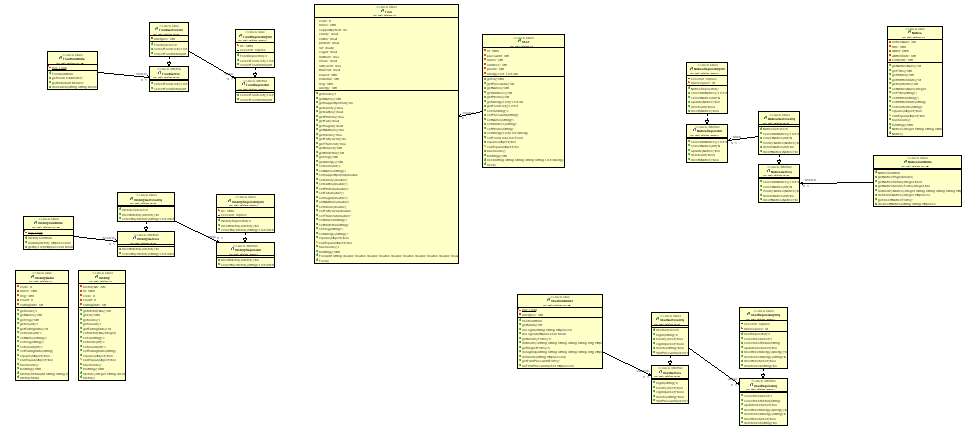
 

- 로그인 
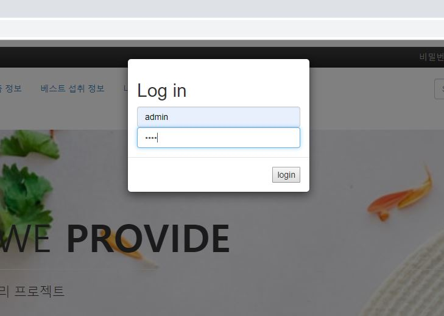
 

- 로그아웃 
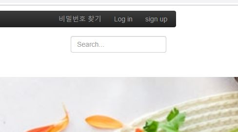
 

- 회원가입 

 

- 상품목록조회 

 

- 상품명검색 
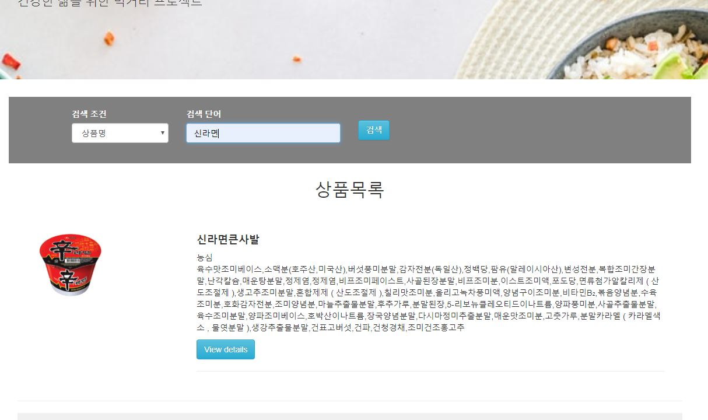
 

- 재료기반검색 
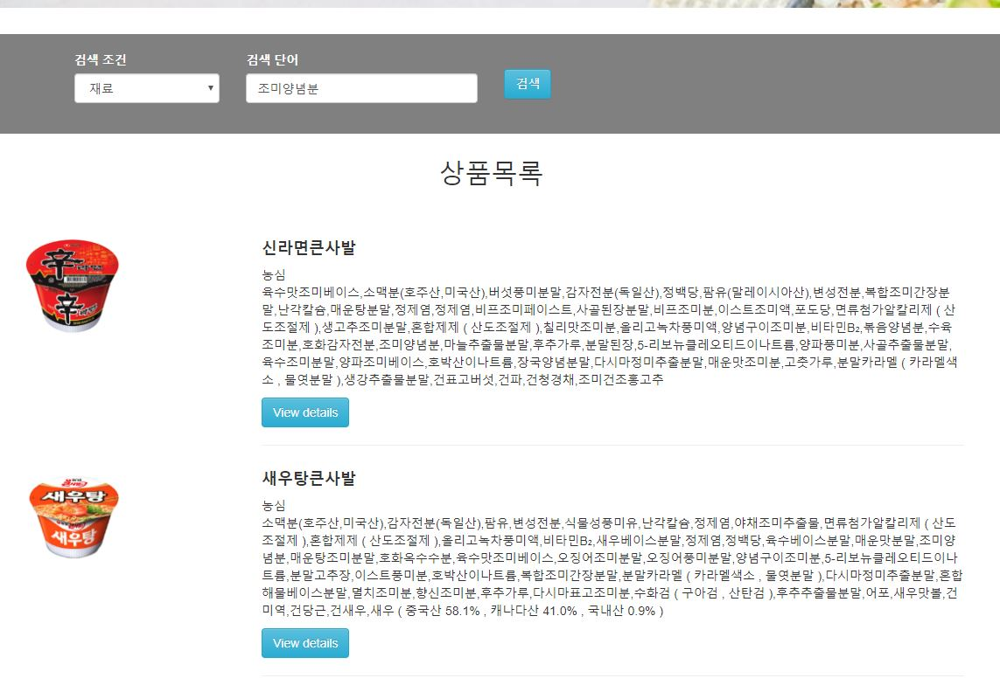
 

- 제조사기반검색 
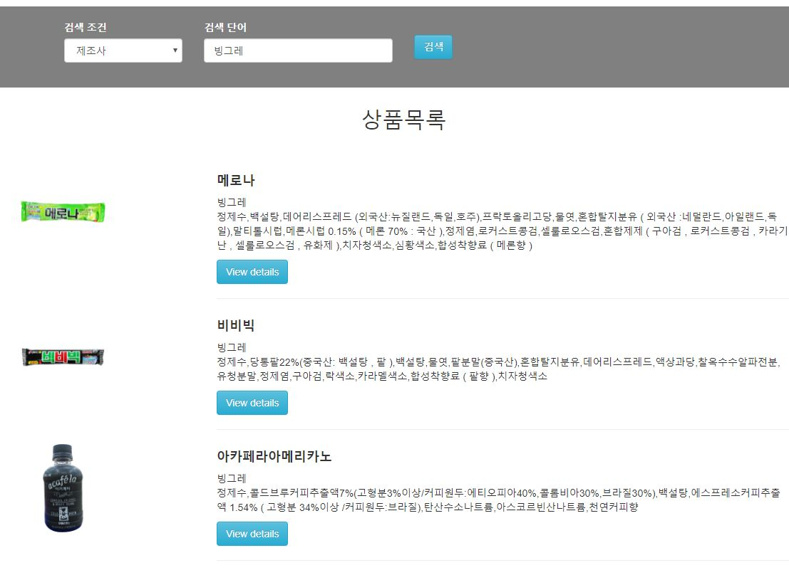
 

- 제품상세조회 

 

- 공지사항조회 
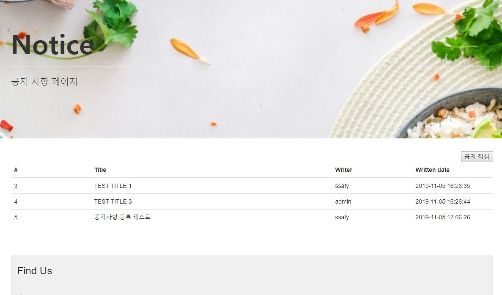
 

- 공지사항등록 

 

- 공지사항수정삭제 

 
    
- 게시글 등록1 

 

- 게시글 등록2 
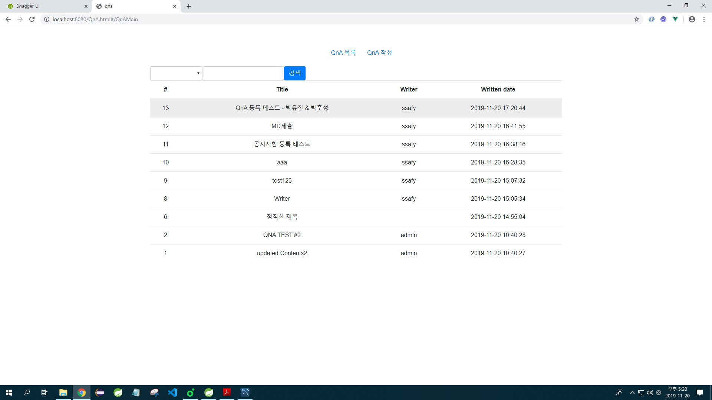
 

- 게시글 목록 
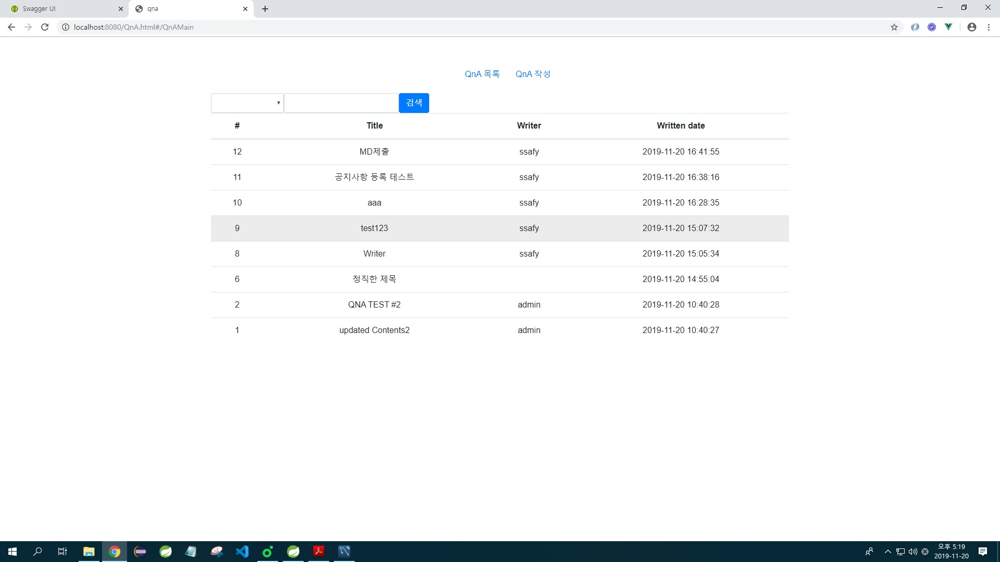
 

- 게시글 삭제1 
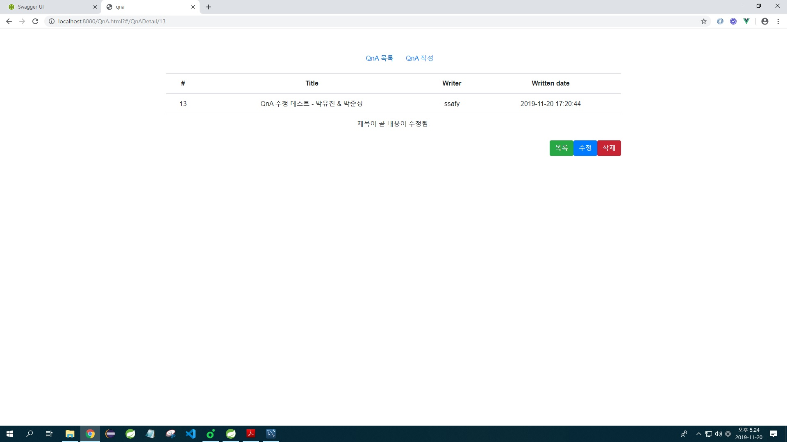
 

- 게시글 삭제2 

 

- 게시글 상세 검색 
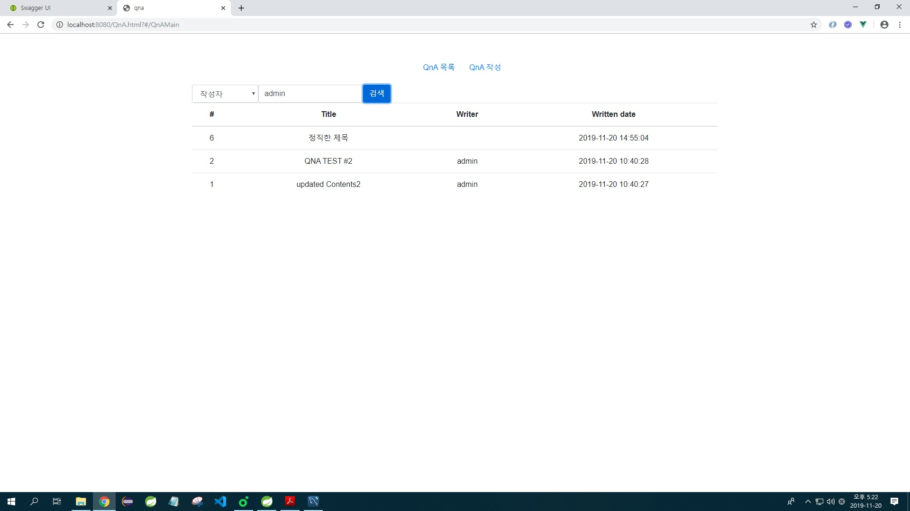
 

- 게시글 수정1 
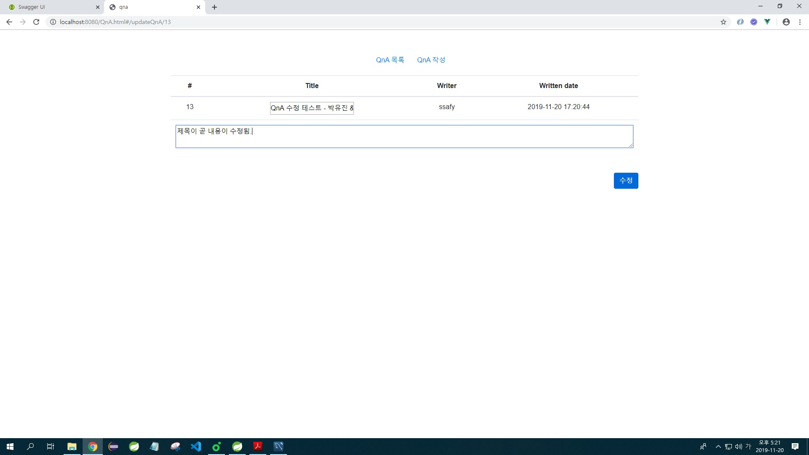
 

- 게시글 수정2 

 

- 게시판 메인 
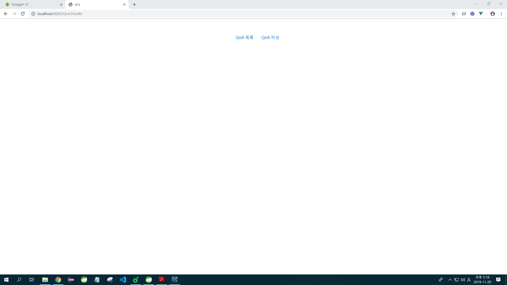
 

