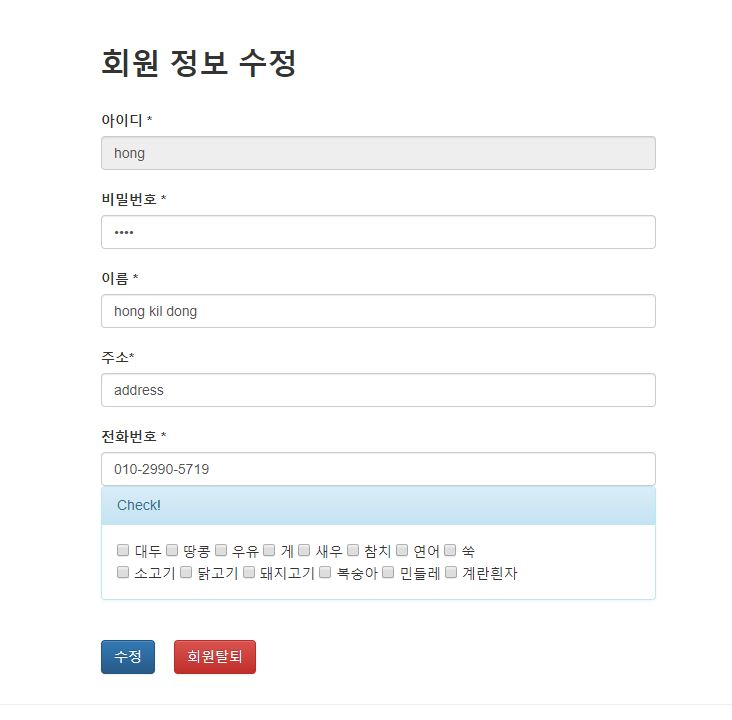
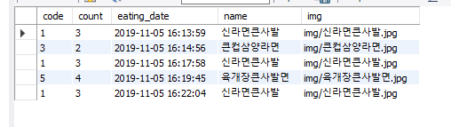

# SafeFood

공공데이터 포털의 식품정보를 활용하여 사용자에게 재료, 칼로리, 알레르기 성분 등의 정보를 제공하여 안전한 식품섭취를 도와주는 웹 
    
처리된 요구사항 목록

|난이도|구현기능|세부기능|작성여부| 
|:---:|:---:|---|:---:| 
|기본|QnA게시판 Vue 적용 웹페이지|게시글목록|O|
|기본|QnA게시판 Vue 적용 웹페이지|게시글등록|O| 
|기본|QnA게시판 Vue 적용 웹페이지|게시글수정|O|
|기본|QnA게시판 Vue 적용 웹페이지|게시글상세검색|O| 
|기본|서버측구현|게시글등록|O|
|기본|서버측구현|게시글목록|O| 
|기본|서버측구현|게시글삭제|O|
|기본|서버측구현|게시글수정|O|
|기본|서버측구현|게시글상세검색|O|
|추가|식품별 검색 빈도수 or 추가기능 - spring mvc에 있는거 아님|기능명|X| 
|심화|메인 페이지 or 추가기능 - spring mvc에 있는거 아님|프로젝트 합치기|O|

게시판 다이어그램 

 
게시글 등록1 

 

게시글 등록2 

 
게시글 목록 

 

게시글 삭제1 

 

게시글 삭제2 

 

게시글 상세 검색 

 

게시글 수정1 

 
게시글 수정2 

 
게시판 메인 

 
게시판 DB 

 

**기존 항목**
클래스 다이어그램 

 
로그인 

 
로그아웃 

 
회원가입 

 
회원정보수정삭제 

 
상품목록조회 

 
상품명검색 

 
재료기반검색 

 
제조사기반검색 

 
제품상세조회 

 
공지사항조회 

 
공지사항등록 

 
공지사항수정삭제 

 
Insert History 

 
